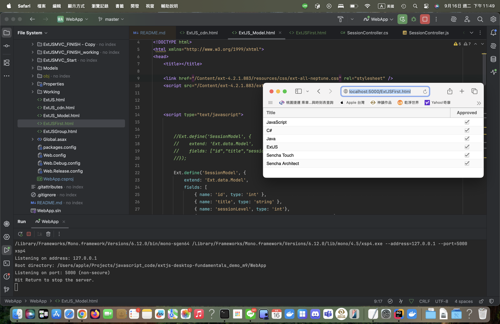

# [ExtJS4] Lesson Sample - module 9

Fix json error and dotnet enity framework error

## Pluralsights Lesson:
ExtJS 4 Desktop Fundamentals
https://app.pluralsight.com/library/courses/extjs-desktop-fundamentals/exercise-files

## Demo Steps:

1. Start a MS sql server via docker (with our default credential) for demo: 
    ```
    docker pull mcr.microsoft.com/mssql/server@sha256:b94071acd4612bfe60a73e265097c2b6388d14d9d493db8f37cf4479a4337480 
    docker run -e 'ACCEPT_EULA=Y' -e 'SA_PASSWORD=1StrongPassword!' -p 1433:1433 -d mcr.microsoft.com/mssql/server
    ```

2. Open IDE IntelliJ Rider (if use Mac), and run WebApp project. (Listen on port 5000 as default)
   > UPDATES   
   > 2025/02: Added CORS header for .net framework 4.8 via update Global.asax.cs and Web.config)

Option #1:

3. Open a terminal, go to folder WebApp/ and run a http server service via python:
    ```
    cd <repo_root_folder>/WebApp
    python -m http.server
    ```
4. Open a browser like chrome or firefox, and enable dev tool. Then go to url 'http://127.0.0.1:8000/ExtJS_Model.html'

Result: Your will see the console showing the session object loaded from `user.load(...)` via model proxy url: 'http://127.0.0.1:5000/api/session'.

Option #2:

3. Open a browser like chrome or firefox, and enable dev tool. Then go to url 'http://127.0.0.1:5000/ExtJSFirst.html' (OR 'http://localhost:5000/ExtJSFirst.html')

Result: CUR via model proxy url: 'http://127.0.0.1:5000/api/session'.

